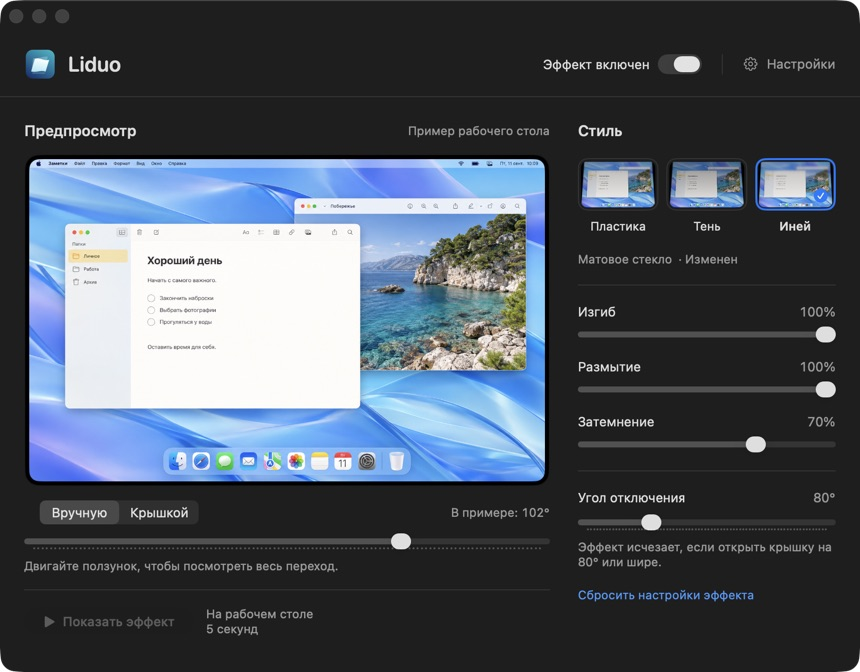

# Liduo

**A lid-driven desktop effect for your MacBook.**

[Русский](README.md) · [Install](docs/INSTALLING.md) · [Build from source](docs/BUILDING.md) · [Privacy](PRIVACY.md) · [Changelog](CHANGELOG.md)

Liduo bends, blurs, and darkens the desktop as you close your MacBook's lid.
It lives in the menu bar and processes screen content on your Mac.
The effect works offline; checking for and downloading updates needs an internet connection.



*Actual settings window. The preview uses a bundled sample image; the full-screen
 effect uses the contents of the built-in display. The interface is currently in Russian.*

## What it does

- Three styles: **Пластика** (soft bend), **Тень** (deeper shading), and **Иней** (frosted glass).
- Adjustable bend, blur, darkness, and the angle at which the effect disappears.
- Manual preview, lid-controlled preview, and a five-second desktop demonstration.
- **⌘⌥B** to toggle the effect or stop a demonstration.
- Optional opening sound and launch at login.
- Built-in signed updates, with optional daily checks and installation by consent.
- Capture and rendering stop when no longer needed; identical frames reuse prepared blur.

## Status and requirements

**Experimental version 0.2.5.** [Download the release](https://github.com/cypresskir/Liduo/releases/tag/v0.2.5)
or install it with Homebrew or npx. The archive is ad-hoc signed; it has no Developer ID certificate or Apple notarization.
Development-signed local builds are separate from this downloadable archive.

- macOS **26 or later** and an **Apple silicon MacBook with a compatible lid-angle sensor**.
- Tested on a **MacBook Pro with M4 Pro**. Compatibility with other models is not established.
- The full-screen effect needs macOS screen-recording permission. The sample preview does not.
- Only the built-in display is affected; external displays remain unchanged.

## Install

With Homebrew:

If Homebrew is not installed, open Terminal and run the
[official installation command](https://brew.sh/):

```sh
/bin/bash -c "$(curl -fsSL https://raw.githubusercontent.com/Homebrew/install/HEAD/install.sh)"
```

After installation, run the commands shown under **Next steps** to make `brew`
available in your terminal. Then install Liduo:

```sh
brew tap cypresskir/liduo https://github.com/cypresskir/Liduo
brew install --cask cypresskir/liduo/liduo
```

If you trust this unnotarized build, allow **only Liduo** to run:

```sh
xattr -dr com.apple.quarantine "/Applications/Liduo.app"
open "/Applications/Liduo.app"
```

Or, with Node.js 22+ and npx, install directly from GitHub:

```sh
npx --yes --allow-git=all github:cypresskir/Liduo#v0.2.5 --allow-unnotarized
open "/Applications/Liduo.app"
```

`--allow-git=all` permits GitHub fetching for this npx command, as required by npm 12.
The installer verifies SHA-256. `--allow-unnotarized` removes quarantine only
from the installed app; without it quarantine is retained. Neither method changes
global Gatekeeper settings or grants screen access.
See [installation, updates, and a user-folder option](docs/INSTALLING.md).

After installation, use **Проверить обновления…** in Liduo's menu or General Settings.
Optional automatic checking is off by default. Updates are signed independently of
Apple Developer ID. See [UPDATES.md](docs/UPDATES.md) for details and publishing instructions.

## Build and try it

Use **macOS 26+**, **Apple silicon**, the full **Xcode 26.4+**, and **XcodeGen**.
Open Xcode once to finish installing its components. Select that Xcode installation
under **Xcode → Settings → Locations → Command Line Tools**.

```sh
brew install xcodegen
xcodebuild -version
```

Get the source, then run the following commands from the project root:

```sh
git clone https://github.com/cypresskir/Liduo.git
cd Liduo
```

The build script downloads the official Sparkle 2.9.6 distribution, verifies its
SHA-256, and generates the Xcode project. The first dependency download needs an
internet connection; subsequent builds use the `.build/` cache. A separate Metal
Toolchain installation is not required.

### Build without an Apple certificate

An ad-hoc signature is enough for a local build. No Apple Developer account or
update-signing key is required:

```sh
./build.sh adhoc
```

This produces `dist/Liduo-v0.2.5-macos-arm64-adhoc.zip` and an adjacent `.sha256` file.
The script does not overwrite an existing archive. Before rebuilding, move the
previous ZIP and its `.sha256` file to a backup folder.

Extract the app into a temporary folder:

```sh
liduo_stage=$(mktemp -d "${TMPDIR:-/tmp}/Liduo.XXXXXX")
ditto -x -k dist/Liduo-v0.2.5-macos-arm64-adhoc.zip "$liduo_stage"
open "$liduo_stage"
```

Drag `Liduo.app` from that folder into Applications. If Liduo is already installed,
quit it from its menu and move the previous copy to a backup folder first. Then run:

```sh
open "/Applications/Liduo.app"
```

If macOS blocks a downloaded build, see [Install](#install) for an app-only launch
exception. Removing quarantine is normally unnecessary for a locally built app.

### Build with a stable signing identity

If you already have an **Apple Development** certificate, use it for local updates
so macOS can recognize existing screen permission. Substitute your Team ID and the
certificate SHA-1 shown by the first command:

```sh
security find-identity -v -p codesigning
export LIDUO_TEAM_ID="YOUR_TEAM_ID"
export LIDUO_SIGN_IDENTITY="YOUR_CERTIFICATE_SHA1"
./build.sh development
```

This produces `dist/Liduo-v0.2.5-local-arm64.zip`. Extract and install it as above,
substituting that archive name in the `ditto` command. Keep the bundle identifier,
certificate, and installation folder stable across updates. Ad-hoc builds may
require screen permission again. See [Xcode and signing instructions](docs/BUILDING.md).

### First launch

1. Choose **Разрешить доступ…** and enable Liduo in macOS screen-recording settings.
2. Restart Liduo if macOS asks.
3. Choose **Показать эффект** or gently move the lid. **⌘⌥B** turns the effect off.

The bundled sample preview works without permission. Closing the window leaves
Liduo running in the menu bar; choose **Выйти из Liduo** to quit.

### Checks

```sh
./build.sh check          # compile only; no installation or archive
./scripts/test.sh unit    # core tests; no signing certificate needed
npm test                 # installer and signature tests; requires Node.js 22+
```

`./scripts/test.sh all` also exercises Metal and the built-in display. It requires
an unlocked graphical session on a MacBook and briefly shows an animation.
Preparing a signed update feed is only needed when releasing a version; see the
[update publishing instructions](docs/UPDATES.md).

## How it works

SwiftUI and AppKit provide the interface. A background IOKit HID reader supplies
lid angles. ScreenCaptureKit captures the built-in display while excluding Liduo's
own windows. Metal and Metal Performance Shaders render the fold, blur, and shading.
The shader is compiled at runtime from the bundled source; no separate Metal
Toolchain download is needed for the project build.

Screen frames stay in memory. Liduo does not record audio, save desktop images,
or send captured content anywhere. See [Privacy](PRIVACY.md).

## Current limitations

- This is an image overlay: application windows and their click coordinates do not move.
- The frosted appearance is a custom shader, not the native Liquid Glass material.
- The lid sensor format is hardware-dependent and is not a public Apple compatibility contract.
- Hiding the pointer over another application's window uses an optional, undocumented
  WindowServer connection property. If unavailable, background cursor hiding may not work.
- Capture is SDR, at most 2560 pixels wide and 60 fps. Rendering can target up to
  120 fps on ProMotion; that is not a guaranteed frame rate on every Mac.
- Protected content may be absent from capture. Sleep and display behavior remain controlled by macOS.
- Long-term battery use and the full range of MacBook models have not been validated.

See [testing and known verification limits](docs/TESTING.md) before relying on performance claims.

## Contributing and license

Bug reports and focused improvements are welcome. Start with [CONTRIBUTING.md](CONTRIBUTING.md).
Source code and documentation text are under the [MIT license](LICENSE).
The bundled preview image has [separate asset terms](ASSETS.md).

Inspired by [Bendy](https://trybendy.app/). Liduo is an independent implementation
and includes no Bendy source code or assets.
